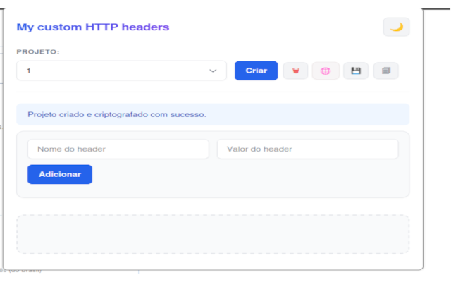
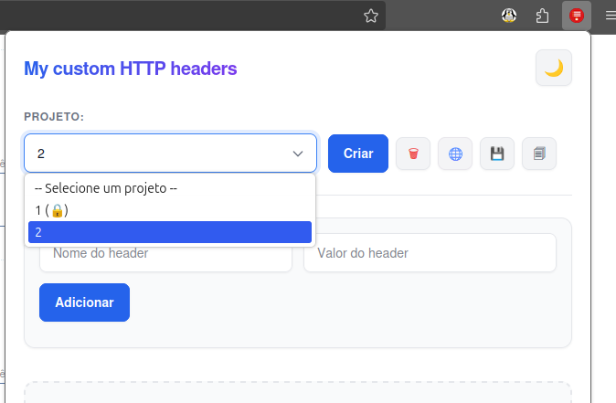
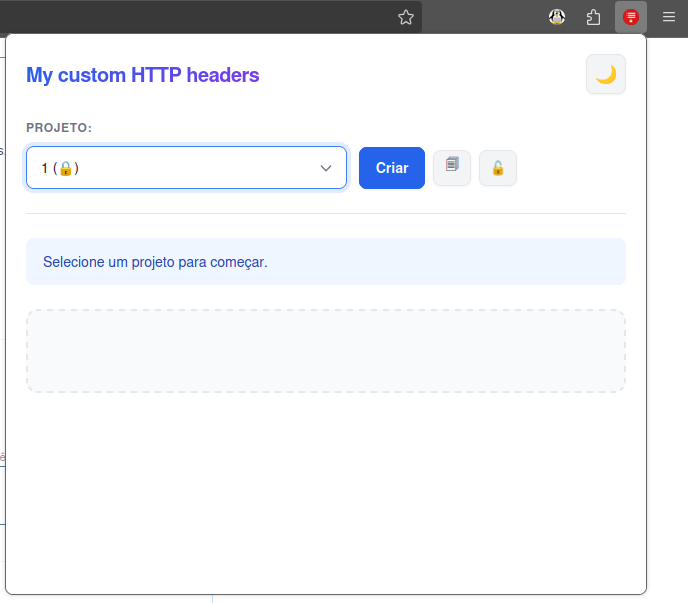
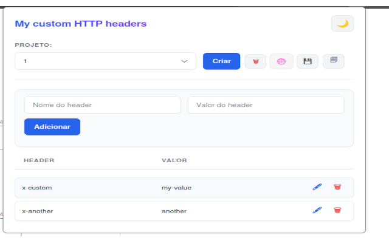
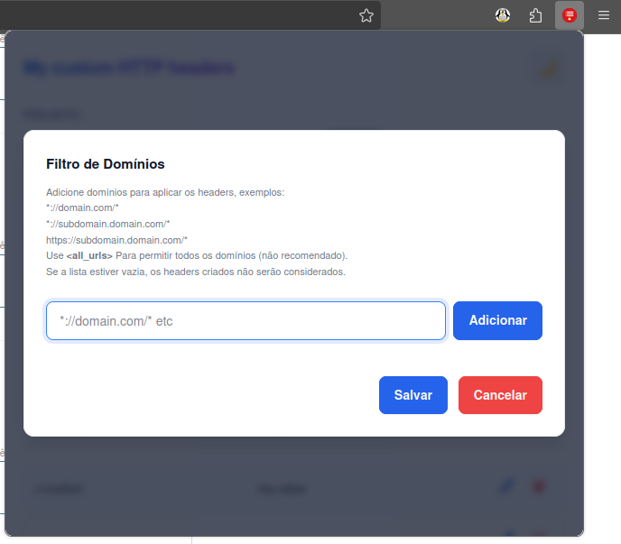
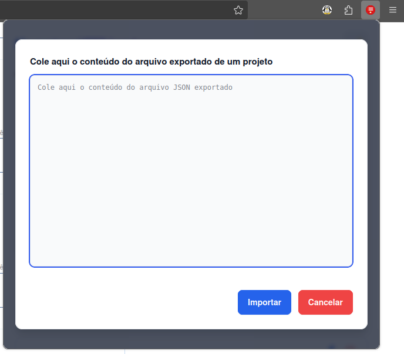

# My Custom HTTP Headers

[](https://opensource.org/licenses/MIT)

Uma extensão de navegador para gerenciar e injetar headers HTTP customizados em requisições web, com foco em segurança e organização através de projetos criptografados.

É 100% gratuita, de código aberto e não coleta dados do usuário.

## Visão Geral

Esta extensão permite que desenvolvedores e testadores modifiquem headers de requisições HTTP de forma fácil e segura. Organize seus headers em projetos separados e proteja informações sensíveis com criptografia baseada em senha, garantindo que seus dados permaneçam seguros e acessíveis apenas durante a sessão de uso.
Disponível na [Chrome Web Store](https://chromewebstore.google.com/detail/my-custom-http-headers/ilnempnhgjkfddghghnijjcoehnidopk).
Em breve, disponível para o [Firefox](https://addons.mozilla.org/pt-BR/firefox/addon/my-custom-http-headers/).

## Funcionalidades

- **Gerenciamento de Headers**: Adicione, edite e remova headers HTTP customizados com facilidade.
- **Organização por Projetos**: Crie múltiplos projetos para agrupar diferentes conjuntos de headers e domínios, ideal para alternar entre contextos de trabalho.
- **Criptografia Segura**: Todos os projetos são armazenados localmente e protegidos com criptografia forte (AES-GCM). A senha nunca é armazenada, sendo solicitada apenas para desbloquear um projeto por sessão.
- **Importação e Exportação**: Exporte seus projetos para um arquivo JSON para backup ou compartilhamento e importe-os facilmente em outra instalação da extensão.
- **Tema Claro e Escuro**: Adapte a aparência da extensão ao seu gosto com um seletor de tema.
- **Privacidade em Primeiro Lugar**: Nenhuma informação é enviada para servidores externos. Todos os dados, incluindo projetos e headers, são armazenados localmente no seu navegador, tenha backup dos projetos que criar, caso seja complicado recriar tudo do zero.

## Permissões Necessárias

A extensão "My Custom HTTP Headers" solicita as seguintes permissões para funcionar corretamente:

- `storage`: Para salvar seus projetos e configurações de forma persistente e segura no armazenamento local do navegador.
- `webRequest` e `webRequestBlocking`: Para interceptar e modificar os headers das requisições HTTP conforme as regras do projeto ativo.
- `optional_host_permissions`: Permite que o usuário conceda permissão para domínios específicos em vez de todos os sites, aumentando a segurança e o controle.

## Como Construir a Partir do Código-Fonte

Se você deseja modificar ou construir a extensão a partir do código-fonte, siga os passos abaixo.

### Pré-requisitos

- Um navegador Mozilla Firefox ou Chromium/Google Chrome.

### Passos para Instalação Local

1 - Clone ou faça o download deste repositório:

```bash
git clone https://github.com/oliveiraxavier/my-custom-http-headers.git 
cd my-custom-http-headers
nvm use 24 # ou use sua versão de Node.js preferida
```

2 - Modifique os arquivos no diretório correspondente:

- `firefox/` para a versão Firefox
- `chrome/` para a versão Chrome

3 - Abra seu navegador e navegue até a página de extensões:

- **Firefox**: `about:debugging#/runtime/this-firefox`
- **Chrome/Edge**: `chrome://extensions`

4. Ative o "Modo de Desenvolvedor" (geralmente um botão de alternância no canto superior direito).
5. Clique em "Carregar sem compactação" ou "Load unpacked" e selecione a pasta do navegador que deseja usar. Certifique-se de que exista um `manifest.json` na raiz desse diretório.
6. A extensão estará instalada e pronta para testes.

## Guia de uso

Veja no [**guia de utilização**](/docs/USAGE.md)

## Screenshots








## Licença

Este projeto é licenciado sob a **Licença MIT**. Veja o arquivo `LICENSE` para mais detalhes.
